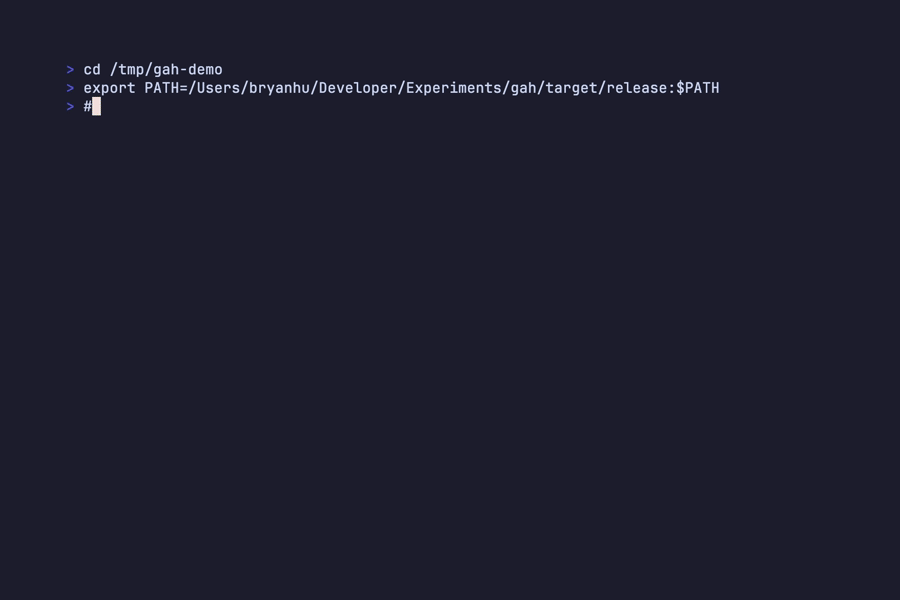

# gah - Git Add Hunks

[](https://github.com/ThatXliner/gah/actions/workflows/ci.yml)
[](https://crates.io/crates/gah)
[](https://opensource.org/licenses/MIT)
[](https://github.com/ThatXliner/gah)

Non-interactive hunk-based staging for git. Stage specific hunks by index, content anchor, regex, or line range—no interactive prompts required.



## The Problem

`git add -p` is great for selective staging, but it requires interactive stdin. That makes it unusable for:

- **AI coding agents** (Claude, Copilot, Cursor) that can't interact with prompts
- **Scripts and automation** that need deterministic staging
- **Remote/headless environments** where interactive TTY isn't available

## Installation

### CLI

```bash
cargo install gah
```

### Claude Code

Install the CLI above, then add the plugin for AI-aware usage:

```
/plugin install ThatXliner/gah
```

Claude Code will auto-use `gah` for selective staging instead of `git add -p`.

### Other AI Agents (Codex, Cursor, etc.)

Install the CLI, then add the skill instructions from [`skills/gah/SKILL.md`](skills/gah/SKILL.md) to your agent's context.

## Usage

### Preview hunks

```bash
# Show hunks with indices
gah preview src/main.rs

# Preview all modified files
gah preview --all

# Machine-readable JSON output
gah preview src/main.rs --json
```

Output:
```
[1:Apparent] @@ -341,7 +341,8 @@ fn render_key_summary(
    context line
 + new line
 - old line
    context line

[2:Caption] @@ -363,7 +364,15 @@ fn render_binding_summary(
    ...

src/main.rs: 2 hunks
```

The word after the index is the **anchor**—a single-token content hash that stays stable even when line numbers shift. Anchors are chosen to be single tokens in common LLM tokenizers for maximum efficiency.

### Stage by hunk index

```bash
# Stage specific hunks
gah add src/main.rs --hunks 1,3,5

# Stage a range
gah add src/main.rs --hunks 1-3,7
```

### Stage by anchor (content hash)

Anchors are stable identifiers based on hunk content. Unlike indices, they don't change when other hunks are staged or when line numbers shift. Ideal for AI agents that preview once, then stage later.

```bash
# Stage by full or partial anchor
gah add src/main.rs --anchor Apparent
gah add src/main.rs -a App      # prefix match works
```

### Stage by regex

```bash
# Stage hunks containing a pattern
gah add src/main.rs --grep "TODO"

# Exclude hunks matching a pattern
gah add src/main.rs --grep "debug" --invert
```

### Stage by line range

```bash
# Stage hunks overlapping line range (working tree lines)
gah add src/main.rs --lines 100-150

# Multiple ranges
gah add src/main.rs --lines 100-150,200-250
```

### Combine filters

```bash
gah add src/main.rs --grep "feature" --lines 300-500
```

### Dry run

```bash
# See what would be staged without actually staging
gah add src/main.rs --hunks 1,3 --dry-run
```

## JSON Output

Add `--json` for structured output:

```bash
gah preview src/main.rs --json
```

```json
{
  "file": "src/main.rs",
  "hunks": [
    {
      "index": 1,
      "anchor": "Apparent",
      "header": "@@ -341,7 +341,8 @@",
      "old_start": 341,
      "old_count": 7,
      "new_start": 341,
      "new_count": 8,
      "content": "...",
      "function_context": "fn render_key_summary(",
      "additions": 1,
      "deletions": 0
    }
  ]
}
```

## Why not just use...

**`git add -p`** — Requires interactive stdin. Can't be used programmatically.

**`git add -N` + `git add -p`** — Still requires interactive input.

**`git apply`** — Works, but you need to manually construct the patch. `gah` handles the patch construction for you.

**Editor integrations** — Great when available, but not always accessible to scripts or agents.

## How it works

1. Runs `git diff` to get the current changes
2. Parses the diff into individual hunks
3. Filters hunks based on your criteria
4. Reconstructs a minimal patch for selected hunks
5. Applies via `git apply --cached`

## License

MIT
